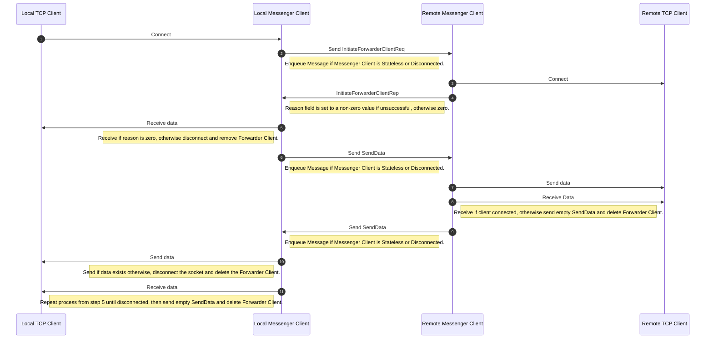

# Messenger Communication Protocol

Messenger communications adhere to a set protocol for transmitting messages. The protocol and structure of Messages are defined below.
When the word 'Variable' is used, it indicates that the corresponding field has a 4-byte length field appended to the value.

## Message

Messenger Messages are a TLV-type structure with an AES-encrypted value of variable length. 

```
+----------------------+----------------------+-----------------------+-------------------------+
|     Message Type     |    Message Length    |   Initialization IV   |   AES Encrypted Value   |
+----------------------+----------------------+-----------------------+-------------------------+
|       4 bytes        |       4 bytes        |       16 bytes        |     Variable length     |
+----------------------+----------------------+-----------------------+-------------------------+
```

## Values

There are several types of values so that Messenger can accomplish the task of establishing TCP connections and sending
data. 

### InitiateForwarderClientReq

```
+-----------------------------+-----------------------------+-----------------------------+
|     Forwarder Client ID     |         IP Address          |            Port             |
+-----------------------------+-----------------------------+-----------------------------+
|          Variable           |          Variable           |          4 bytes            |
+-----------------------------+-----------------------------+-----------------------------+
```

### InitiateForwarderClientRep

```
+-----------------------------+-----------------------------+-----------------------------+-----------------------------+-----------------------------+
|     Forwarder Client ID     |         Bind Address        |          Bind Port          |        Address Type         |           Reason            |
+-----------------------------+-----------------------------+-----------------------------+-----------------------------+-----------------------------+
|          Variable           |          Variable           |          4 bytes            |          4 bytes            |          4 bytes            |
+-----------------------------+-----------------------------+-----------------------------+-----------------------------+-----------------------------+
```

### Send Data

```
+-----------------------------+-----------------------------+
|     Forwarder Client ID     |             Data            |
+-----------------------------+-----------------------------+
|          Variable           |          Variable           |
+-----------------------------+-----------------------------+
```

### Check In

```
+-----------------------------+
|        Messenger ID         |
+-----------------------------+
|          Variable           |
+-----------------------------+
```

## Communication Flows

Messenger is a client-server application, so there are local and remote versions of Messenger Clients that negotiate using the above message structures to achieve the task of
initiating TCP clients and sending data to them locally and remotely. In the case of Local Remote Port Forwards or SOCKS5 Proxies, the local messenger client would be the Messenger Server. 
In the case of Remote Port Forwards, the local messenger client would be the Messenger Client. 

### General Connection Request and Data Propagation Negotiation


