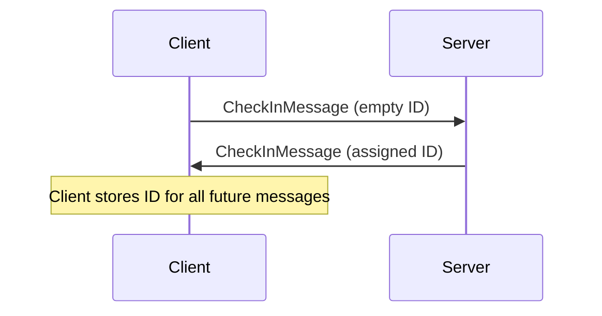
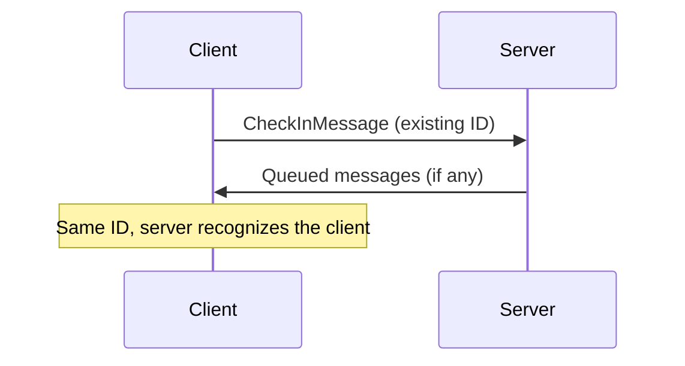
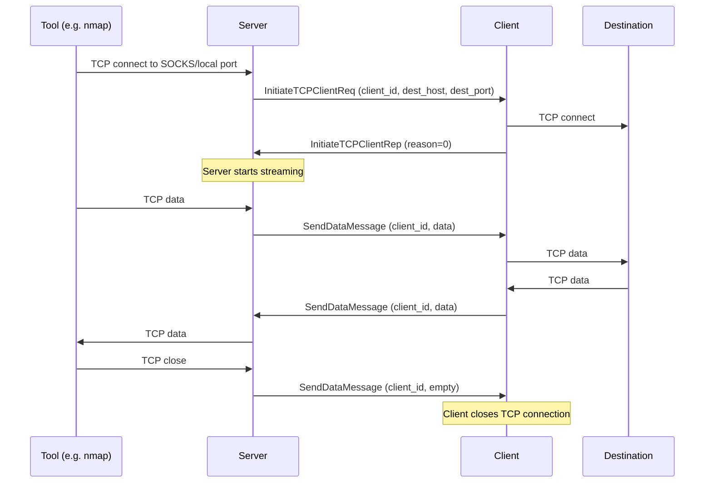
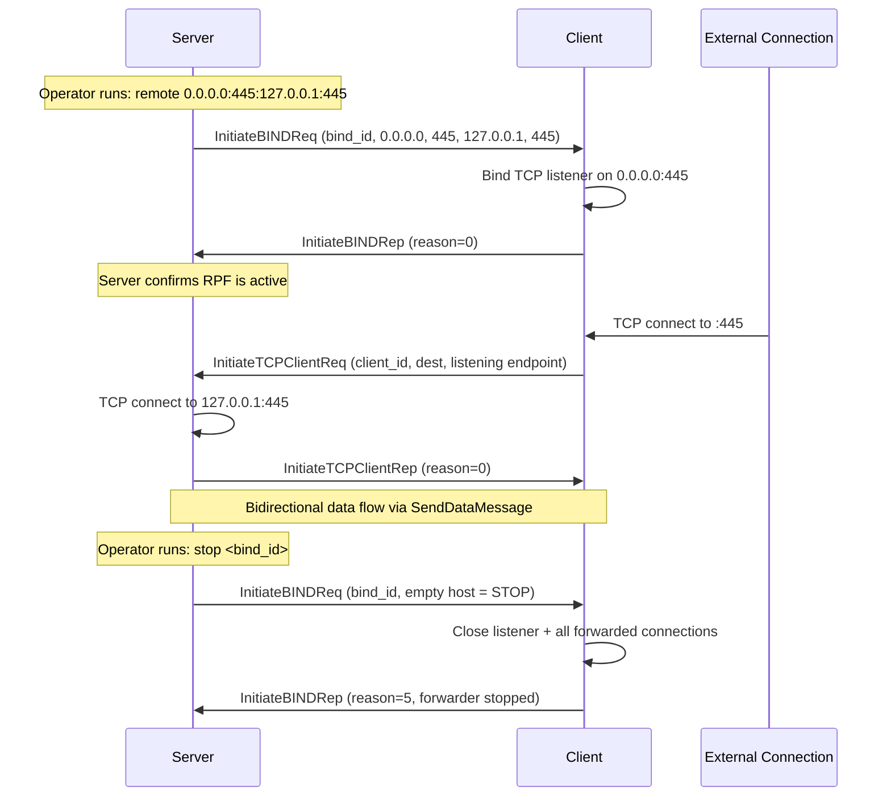
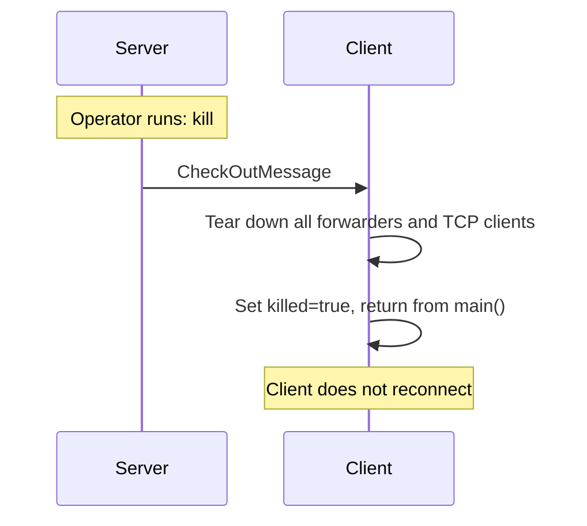

# Communication Overview

Messenger uses a binary message protocol over HTTP or WebSocket transports. All messages (except CheckIn and CheckOut) are AES-256-CBC encrypted with a shared key.

## Wire Format

Each message is a type-length-value frame:

```
+-------------------+---------------------+-------------------+---------------------+
|  Message Type     |  Message Length      |  Initialization   |  AES Encrypted      |
|  (4 bytes, BE)    |  (4 bytes, BE)      |  Vector (16 bytes)|  Payload (variable) |
+-------------------+---------------------+-------------------+---------------------+
```

- **Message Length** includes the 8-byte header (type + length fields)
- **CheckIn** (0x04) and **CheckOut** (0x07) are **not encrypted** -- they have no IV/AES layer
- Multiple messages may be concatenated in a single transport frame
- Strings within payloads are length-prefixed: `[4-byte length][UTF-8 bytes]`
- Binary data (SendDataMessage) is base64-encoded inside the encrypted envelope

## Message Types

| Type ID | Name | Encrypted | Direction |
|---------|------|-----------|-----------|
| 0x01 | InitiateTCPClientReq | Yes | Bidirectional |
| 0x02 | InitiateTCPClientRep | Yes | Bidirectional |
| 0x03 | SendDataMessage | Yes | Bidirectional |
| 0x04 | CheckInMessage | No | Client -> Server |
| 0x05 | InitiateBINDReq | Yes | Server -> Client |
| 0x06 | InitiateBINDRep | Yes | Client -> Server |
| 0x07 | CheckOutMessage | No | Server -> Client |

### CheckInMessage (0x04)

```
+-----------------------------+
|       Messenger ID          |
|     (length-prefixed)       |
+-----------------------------+
```

Sent by the client on every poll/send cycle. On first connect the ID is empty; the server assigns one and echoes it back.

### InitiateTCPClientReq (0x01)

```
+-------------+------------------+------------------+----------------+----------------+
|  Client ID  | Destination Host | Destination Port | Listening Host | Listening Port |
|  (variable) |    (variable)    |    (4 bytes)     |   (variable)   |   (4 bytes)    |
+-------------+------------------+------------------+----------------+----------------+
```

Requests a TCP connection. For local port forwards and SOCKS, the server sends this to the client. For remote port forwards, the client sends this to the server (with the listening endpoint so the server can route to the correct RPF).

### InitiateTCPClientRep (0x02)

```
+-------------+--------------+-----------+--------------+--------+
|  Client ID  | Bind Address | Bind Port | Address Type | Reason |
|  (variable) |  (variable)  | (4 bytes) |  (4 bytes)   |(4 bytes)|
+-------------+--------------+-----------+--------------+--------+
```

Reason codes: 0=success, 1=general failure, 3=network unreachable, 4=host unreachable, 5=connection refused, 6=TTL expired, 7=protocol not available, 8=address family not supported.

### SendDataMessage (0x03)

```
+-------------+--------------------+
|  Client ID  |       Data         |
|  (variable) | (variable, base64) |
+-------------+--------------------+
```

Carries TCP data for a client connection. Empty data is the close signal -- the receiving side tears down the TCP client.

### InitiateBINDReq (0x05)

```
+-----------+----------------+----------------+------------------+------------------+
|  Bind ID  | Listening Host | Listening Port | Destination Host | Destination Port |
| (variable)|   (variable)   |   (4 bytes)    |    (variable)    |    (4 bytes)     |
+-----------+----------------+----------------+------------------+------------------+
```

Server -> Client. Creates or stops a remote port forward. An **empty listening host** is the stop signal.

### InitiateBINDRep (0x06)

```
+-----------+----------------+----------------+--------+
|  Bind ID  | Listening Host | Listening Port | Reason |
| (variable)|   (variable)   |   (4 bytes)    |(4 bytes)|
+-----------+----------------+----------------+--------+
```

Client -> Server. Reason codes: 0=forwarding, 1=general failure, 2=address in use, 3=permission denied, 4=address resolution failed, 5=forwarder stopped.

### CheckOutMessage (0x07)

Empty payload. Server -> Client kill signal.

## Communication Flows

### Check-In (First Connect)



### Check-In (Reconnect)



### Local Port Forward / SOCKS Data Flow



### Remote Port Forward Lifecycle



### Kill (CheckOut)



## Transport Details

### WebSocket

- Binary frames, full-duplex
- Client prepends a CheckInMessage to every send batch
- Single-writer rule: exactly one task writes to the socket (send_loop drains a queue)
- Messages queued while disconnected are retained and sent on reconnect

### HTTP

- POST requests, client polls the server
- Each request body = serialized message batch (always starts with CheckIn)
- Response body = server's queued messages for this client
- Poll interval is implementation-defined (typically 100ms-1000ms)
- Stateless from the transport layer's perspective -- the CheckIn ID is the session token

## Encryption

- Algorithm: AES-256-CBC with PKCS7 padding
- Key derivation: SHA-256 hash of the shared passphrase
- IV: 16 random bytes, prepended to ciphertext
- CheckIn and CheckOut messages are **not encrypted** (the CheckIn ID is how the server identifies the client before any shared state exists)
- TLS certificate validation is disabled (self-signed certs are expected in pentest environments)
